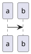

# My GitBook

Welcome to my GitBook!

https://myapp.com/

<block>
    
</block>

<block name=plantuml>
Block plantuml
</block>

***

***

***

example site : https://github.com/GitbookIO/plugin-puml/blob/master/index.js
